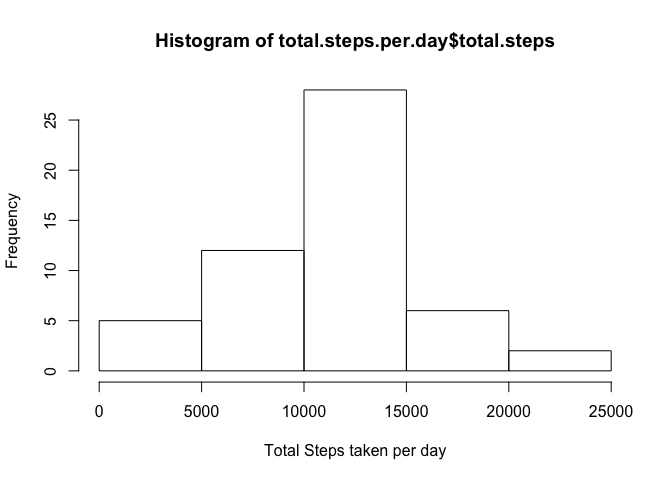
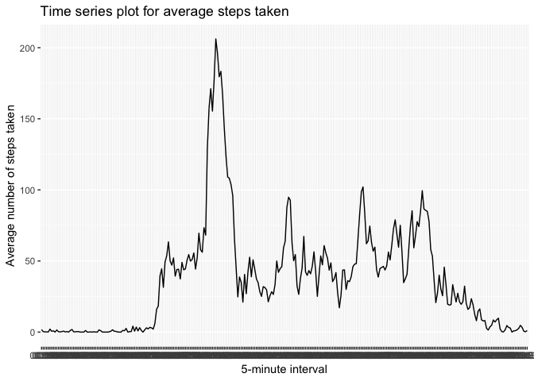
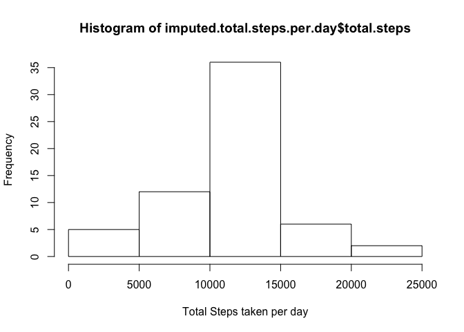
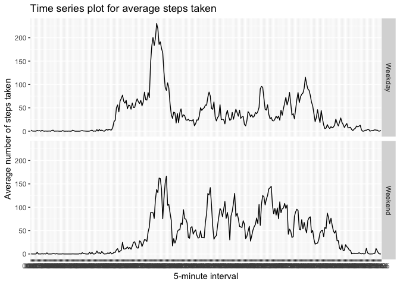

#Below are the tasks requested and their respective R code to achieve the same

##Load the required libraries

```r
library(dplyr)
library(stringr)
library(lubridate)
library(timeDate)
library(ggplot2)
```

## Loading and preprocessing the data

###1. Load the data (i.e.read.csv())

```r
activity <- read.csv("../activity.csv")
```

###2. Process/transform the data (if necessary) into a format suitable for your analysis
Adding two additional columns - activitytime (HH:MM format) and datetime (date + activitytime)

```r
activity <- activity$interval %>%
  str_pad(4, side= c("left"), pad = "0") %>%
  strptime(format="%H%M") %>%
  format(format = "%H:%M") %>%
  cbind(activity, activitytime = .) %>%
  mutate(datetime = ymd_hm(paste(date, activitytime)))
```

## What is mean total number of steps taken per day?

###1. Calculate the total number of steps taken per day

```r
total.steps.per.day <- activity %>%
                       filter(!is.na(steps)) %>%
                       group_by(date) %>%
                       summarise(total.steps = sum(steps))
```
###2. Make a histogram of the total number of steps taken each day

```r
hist(total.steps.per.day$total.steps, xlab = "Total Steps taken per day")
```

<!-- -->

###3. Calculate and report the mean and median of the total number of steps taken per day

```r
mean(total.steps.per.day$total.steps)
```

```
## [1] 10766.19
```

```r
median(total.steps.per.day$total.steps)
```

```
## [1] 10765
```
## What is the average daily activity pattern?


###1. Make a time series plot (i.e. type="l") of the 5-minute interval (x-axis) and the average number of steps taken, averaged across all days (y-axis)


```r
avg.steps.per.interval <- activity %>%
                          filter(!is.na(steps)) %>%
                          group_by(activitytime) %>%
                          summarise(avg.steps = mean(steps))

ggplot(avg.steps.per.interval, aes(x = activitytime, y = avg.steps, group = 1)) +
    geom_line() +
    labs(title = "Time series plot for average steps taken", x="5-minute interval", y = "Average number of steps taken")
```

<!-- -->

###2. Which 5-minute interval, on average across all the days in the dataset, contains the maximum number of steps?

```r
filter(avg.steps.per.interval, avg.steps == max(avg.steps, na.rm = T))
```

```
## # A tibble: 1 x 2
##   activitytime avg.steps
##   <fct>            <dbl>
## 1 08:35             206.
```

## Imputing missing values

###1. Calculate and report the total number of missing values in the dataset (i.e. the total number of rows with NAs)

```r
colSums(is.na(activity))
```

```
##        steps         date     interval activitytime     datetime 
##         2304            0            0            0            0
```
###2. Devise a strategy for filling in all of the missing values in the dataset. The strategy does not need to be sophisticated. For example, you could use the mean/median for that day, or the mean for that 5-minute interval, etc.

###3. Create a new dataset that is equal to the original dataset but with the missing data filled in.

#### Both these above questions are answered by the below script
#### Here we are imputing based on mean across that interval time for all the days

```r
impute.mean <- function(x) replace(x, is.na(x), mean(x, na.rm = TRUE))

imputed.activity <- activity %>%
    group_by(activitytime) %>%
    mutate(steps = impute.mean(steps))

colSums(is.na(imputed.activity))
```

```
##        steps         date     interval activitytime     datetime 
##            0            0            0            0            0
```

###4. Calculate the total number of steps taken per day

```r
imputed.total.steps.per.day <- imputed.activity %>%
                       filter(!is.na(steps)) %>%
                       group_by(date) %>%
                       summarise(total.steps = sum(steps))
```

###5. Make a histogram of the total number of steps taken each day

```r
hist(imputed.total.steps.per.day$total.steps, xlab = "Total Steps taken per day")
```

<!-- -->

###6. Calculate and report the mean and median of the total number of steps taken per day

```r
mean(imputed.total.steps.per.day$total.steps)
```

```
## [1] 10766.19
```

```r
median(imputed.total.steps.per.day$total.steps)
```

```
## [1] 10766.19
```

## Are there differences in activity patterns between weekdays and weekends?

###1. Create a new factor variable in the dataset with two levels – “weekday” and “weekend” indicating whether a given date is a weekday or weekend day

```r
imputed.activity <- mutate(imputed.activity,
                           daytype = ifelse(isWeekday(as.Date(date)), "Weekday","Weekend" ))
```

###2. Make a panel plot containing a time series plot (i.e.type="l") of the 5-minute interval (x-axis) and the average number of steps taken, averaged across all weekday days or weekend days (y-axis).

#Yes. There is a distinct difference in average steps walked between weekdays and weekends.


```r
imputed.activity.avg.steps.per.interval <- imputed.activity %>%
                          group_by(daytype, activitytime) %>%
                          summarise(avg.steps = mean(steps))

ggplot(imputed.activity.avg.steps.per.interval, aes(x = activitytime, y = avg.steps, group = daytype)) +
    geom_line() +
    facet_grid(daytype ~ .) + 
    labs(title = "Time series plot for average steps taken", x="5-minute interval", y = "Average number of steps taken")
```

<!-- -->
